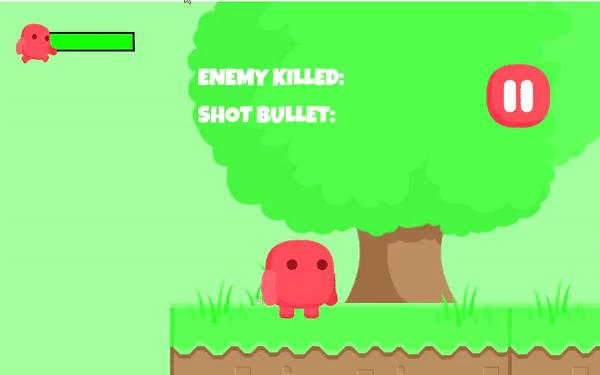

# 2D-Platformer-Game

> 2D Platform Game using Unity and C# based on a tutorial.

## Installation

You can install or clone the repo from github repository. In order for the game to run, ASP.Net and Unity must be installed on your computer. If they are not installed, you can download them from the tag above.

If you just want to play the game, you don't necessary to download repo. You can run the game from [this](https://tewhem.itch.io/mini-platform-game) link.

## Usage Example

When you run the game, you will see the menu screen first.

You can see the your score by clicking the cup icon.

You can move the your character with `arrow keys` or `a,d`.

You can jump with `Space` or `w` keys and shoot with `left click`.

Have a nice try!

If you run into a problem, you can let me know here or on my Twitter account. - [@Mehmetkaragoz07](https://twitter.com/Mehmetkaragoz07) - karagoz.mhmtg@gmail.com

https://github.com/mehmet-karagoz
